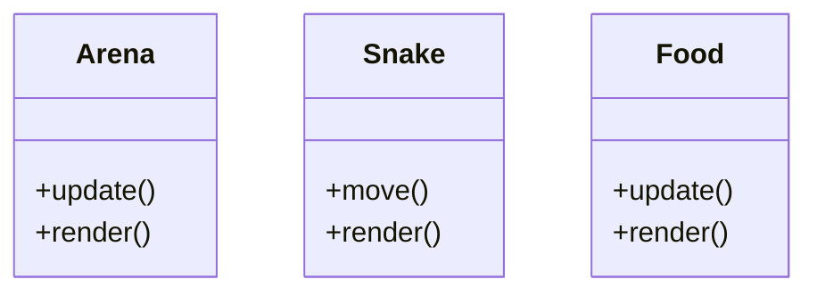

# Jon Macey (jmacey) Assignment Snake  Game

## overview

For my project I'm going to implement the classic snake game using SDL2 and NGL for the visualization. 

The main game will use a fixed above view to start with using an orthographic projection, I will create a simple game arena for the food items to be placed for the snake at random. 

The snake will move in one of 4 directions (UP,DOWN,LEFT,RIGHT) and once the key for the direction is pressed this direction will continue until changed. 

A random food item will be placed in the arena for a set random time, where it will then change position (to make the game harder). 

To start with the snake and food will be simple NGL primitives such as cubes and spheres and I will use better models later. 

## Class Design

At a minimum I'm going to need a _Snake_ class and a _Food_ class.

For ease each time I make an update I will create a new [Part2.md](Part2.md) markdown file with the details of the progress.

